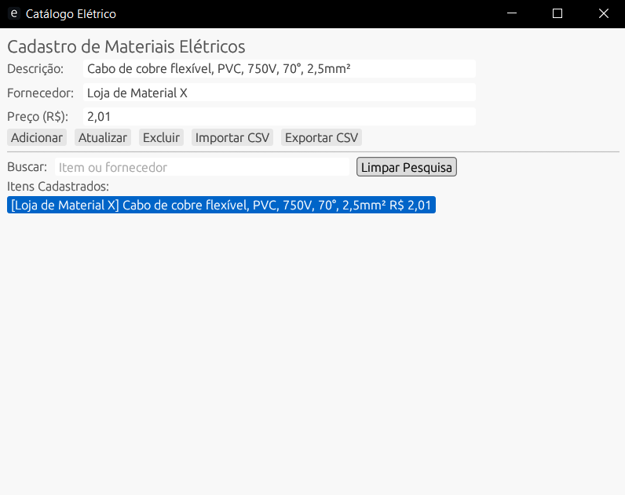

# Catálogo Elétrico Rust

Aplicativo desktop para cadastro e consulta de itens de infraestrutura elétrica, desenvolvido em Rust usando `egui` e SQLite.


## Funcionalidades

- Cadastro, edição e remoção de itens
- Busca por texto
- Importação e exportação CSV
- Interface leve e intuitiva
- Copia para a área de transferência

## Como rodar

```bash
cargo run --release
```
